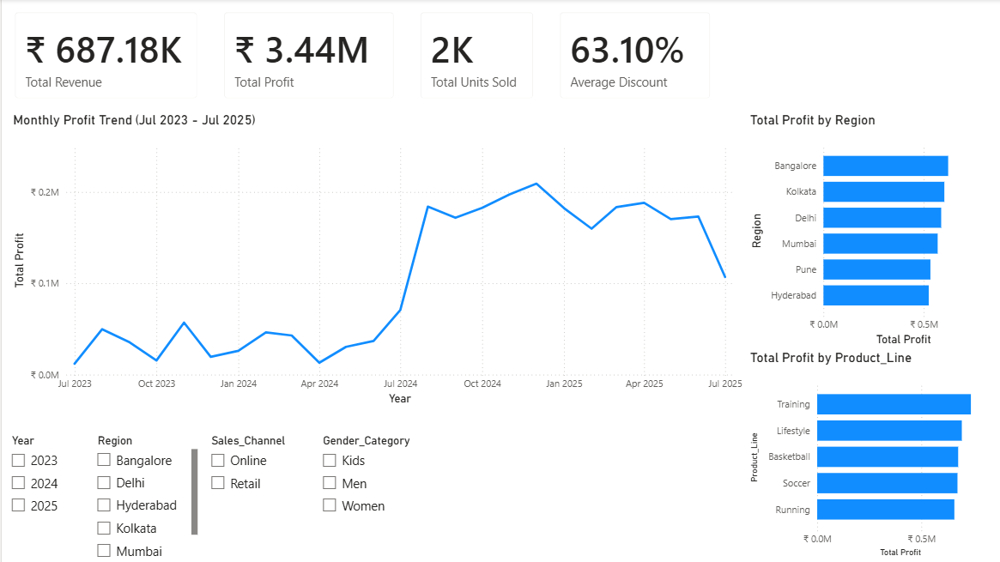

# Nike Sales Analytics

End-to-end sales analytics project using SQL, MySQL, AWS, and Power BI to analyze sales performance, profitability, regional trends, product lines, sales channels, and customer demographics.

## Project Overview

This project analyzes a publicly available sample dataset representing Nike sales in India.

The goal was to move beyond simply querying sales data and build an end-to-end analytics workflow that could be used to identify trends, evaluate business performance, and communicate actionable findings.

The project includes data cleaning and validation, SQL-based exploratory analysis, cloud database infrastructure, and an interactive Power BI dashboard.

## Tools & Technologies

- SQL / MySQL
- AWS S3
- AWS RDS
- Power BI
- DAX
- Excel / CSV
- GitHub

## Data & Analytics Workflow

The project followed an end-to-end analytics workflow:

1. Stored the raw sales dataset in Amazon S3
2. Used Amazon RDS to host the relational database
3. Connected the database to MySQL for data cleaning, transformation, and analysis
4. Used SQL to answer business questions and identify performance trends
5. Built DAX measures in Power BI for key performance indicators
6. Developed an interactive dashboard to explore the results
7. Translated analytical findings into business insights and potential areas for further investigation

## SQL Analysis

The SQL analysis examined:

- Total revenue and profit
- Regional revenue and profitability
- Product-line performance
- Sales channel performance
- Monthly and yearly trends
- Discount patterns
- Units sold
- Customer demographics
- Data quality issues and missing values

The analysis demonstrated the use of aggregate functions, grouping, filtering, date-based analysis, data cleaning, and type conversion.

## Key Business Insights

### 1. Regional Revenue Does Not Necessarily Translate to Profit

Regional analysis showed that Kolkata generated the highest revenue, while Bangalore generated the highest total profit.

Hyderabad was particularly interesting because it generated the second-highest revenue but the lowest total profit among the six regions.

This suggests that revenue alone may not be sufficient for evaluating regional performance. Differences in pricing, discounts, costs, or other business conditions could influence profitability.

The dataset does not contain enough information to determine the exact cause, so these factors would require further investigation.

### 2. Monthly Performance Showed Significant Volatility

Monthly performance fluctuated substantially throughout the period covered by the dataset.

Revenue was relatively low during portions of 2023, while February through April 2024 included negative monthly revenue. March recorded the lowest monthly revenue at -₹2,652.04.

Negative revenue could potentially reflect returns, refunds, or other accounting adjustments, but the dataset does not provide enough information to determine the cause.

Performance improved during the second half of 2024, with December producing the highest monthly revenue in the analysis. December also showed strong performance in the prior year, suggesting a potential seasonal pattern.

However, the available time period is limited, so additional years of data would be needed before treating this as confirmed seasonality.

### 3. Online Sales Showed Recurring Fall Profit Strength

The Power BI analysis showed recurring strength in online profit during the fall period, with November emerging as a notable profit peak across the available years.

December also remained consistently strong.

Compared with retail, online sales showed more frequent profit spikes and became relatively more consistent as the fall period progressed.

One possible explanation is that seasonal promotional opportunities may have increased online purchasing activity. The online channel also showed a higher average discount, which may have contributed to increased consumer activity during this period.

However, the dataset does not establish causation. Further analysis of promotions, holidays, pricing, discounts, and external events would be needed to determine what is driving the pattern.

### 4. Product-Line Performance Varied

Training products generated the highest total revenue among the product lines, while Running generated the lowest.

Training's stronger performance may indicate greater demand, higher unit volume, pricing differences, or other factors.

However, revenue alone cannot determine why one product line outperformed another. Additional analysis of units sold, pricing, discounts, and product-level demand would be needed to identify the underlying drivers.

## Power BI Dashboard

The interactive Power BI dashboard provides:

- KPI summaries for revenue, profit, units sold, and average discount
- Monthly profit trends
- Profit by region
- Profit by product line
- Interactive filtering by year
- Interactive filtering by region
- Interactive filtering by sales channel
- Interactive filtering by gender category

### Dashboard Preview

The `.pbix` file is included in the repository for users who want to explore the dashboard interactively in Power BI Desktop.

## Business Impact & Analytical Takeaways

The analysis demonstrates how raw sales data can be transformed into business questions, analytical findings, and potential areas for action.

Key takeaways include:

- Regional revenue and profitability can tell different stories.
- Strong sales performance does not necessarily indicate strong profitability.
- Monthly performance can vary significantly across sales periods.
- Online and retail channels may respond differently to seasonal opportunities.
- Product-line performance can identify areas that warrant deeper investigation.
- Additional context such as promotions, pricing, discounts, costs, and external events would be necessary to move from observed patterns to confirmed business explanations.

Rather than assuming causation from the available data, the analysis distinguishes between findings directly supported by the dataset and hypotheses that would require additional evidence.

## Project Files

- `NikeSalesAnalysis.sql` — SQL analysis, data exploration, and business questions
- `Nike_Sales_Analysis.pbix` — Interactive Power BI dashboard
- `Nike_Sales_Uncleaned.csv` — Original dataset used for analysis
- `Screenshots/Nike_Sales_Dashboard.png` — Static preview of the Power BI dashboard

## Limitations & Next Steps

This analysis is based on a publicly available sample dataset representing Nike sales in India and is intended for educational purposes.

The dataset identifies correlations and recurring patterns but does not establish the causes behind those patterns.

Potential next steps include:

- Analyze product-level performance
- Compare units sold against revenue and profit
- Investigate the relationship between discounts and profitability
- Analyze promotional and holiday periods
- Investigate the causes of negative monthly revenue
- Incorporate operating-cost data to better evaluate profitability
- Add additional years of data to validate potential seasonal trends
- Incorporate external events and market information to investigate unusual sales patterns

## Conclusion

This project demonstrates an end-to-end SQL and business intelligence workflow, from data cleaning and relational database analysis through cloud infrastructure and interactive Power BI visualization.

The analysis identified regional profitability differences, monthly performance trends, product-line variation, and potential seasonal patterns while highlighting the importance of separating data-supported findings from assumptions about causation.
